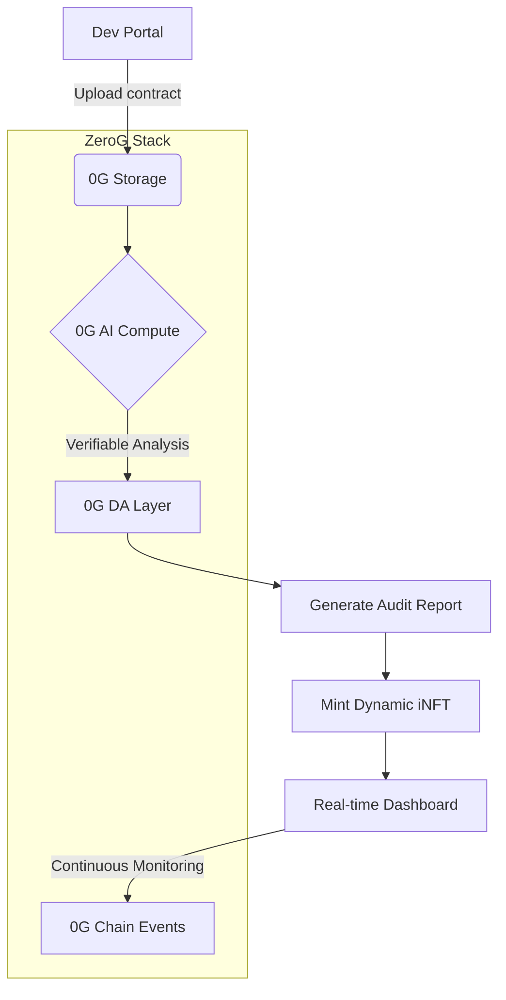

# ChainSage: AI-Powered Smart Contract Auditor
[](https://0g.ai)
[](https://docs.0g.ai/storage)
[](https://github.com/0glabs/INFT)

## Overview
ChainSage leverages 0G's decentralized AI stack to provide:
- ⚡ **Real-time vulnerability detection** using verifiable compute (TML/optimistic ML)
- 📜 **Human-readable reports** with ZeroG DA layer streaming
- 🔒 **Tamper-proof certificates** via dynamic iNFTs (ERC-7857)
- ⛽ **Gas optimization** using historical chain data
- 💸 **95% cheaper storage** for audit datasets vs. AWS

> **Buildathon Insight**: Integrated ZeroG's modular architecture to prevent "hallucinated" vulnerability reports through verifiable compute.

## Enhanced Architecture


## Key Features
| Feature                | Benefit                           | ZeroG Tech Used       |
|------------------------|-----------------------------------|-----------------------|
| Continuous Auditing    | Post-deployment threat monitoring | 0G DA Layer           |
| Versioned Certificates | Immutable audit trail             | iNFT Metadata         |
| Model Swapping         | Custom scanners per contract type | 0G Compute Modules    |
| Gas Oracle             | Optimization recommendations      | Historical Chain Data |

## Setup Guide
## Prerequisites
- Node.js v18+
- [0G Testnet (Galileo)](https://docs.0g.ai/testnet) configured in MetaMask
- 0G API Key from [Developer Portal](https://console.0g.ai/)
- Testnet tokens ([Request Form](https://forms.gle/zerog-faucet))

### Installation
```bash
# Clone with ZeroG starter kit
git clone https://github.com/zoglabs/chain-sage-starter

# Install dependencies
npm install @0g/storage-sdk @0g/compute-sdk

# Configure environment
cp .env.example .env
```

### Running Audits
```javascript
import { ChainSage } from 'chain-sage-sdk';
import { ZeroGStorage } from '@0g/storage-sdk';

const storage = new ZeroGStorage({ network: 'galileo' });
const auditor = new ChainSage({
  aiModel: 'vulnerability-detector-v3',
  storageClient: storage // Using 0G key-value storage
});

// Real-time audit with DA streaming
const report = await auditor.analyzeContract(
  '0xYourContractAddress', 
  {
    auditIntensity: 'deep',
    optimization: true,
    streamToDA: true // Enable 0G DA layer
  }
);

// Generate iNFT certificate
const { tokenURI } = await report.mintINFT();
console.log(`Audit certificate: https://storage-scan.0g.ai/${tokenURI}`);
```

## INFT Integration
Dynamic certificates with version history stored in 0G Storage:
```json
{
  "ai_model": "chain-sage-v1.1",
  "risk_score": 0.18,
  "vulnerabilities": ["reentrancy"],
  "dynamic_fields": {
    "last_scan": "2025-08-17T09:42:11Z",
    "threat_status": "mitigated",
    "version_history": [
      {"scan_id": "a3f8e1", "timestamp": "2025-08-10T14:30:00Z"}
    ]
  },
  "storage_proof": "0g://QmXyZ...PoRA_verified" // Proof of Random Access
}
```

## Demo Video
[Demo Video](https://img.youtube.com/vi/demo/0.jpg)

Resources
- [0G Galileo Testnet Guide](https://docs.0g.ai/testnet)
- [Verifiable Compute SDK](https://github.com/zoglabs/compute-starter)
- [iNFT Development Template](https://github.com/0glabs/inft-starter)
- [Awesome 0G Projects](https://github.com/0glabs/awesome-zerog) (See audit examples)
- [Storage Scan Explorer](https://storage-scan.0g.ai/)

> **Buildathon Ready**: Use our [starter kits](https://github.com/zoglabs?tab=repositories) for accelerated development!
