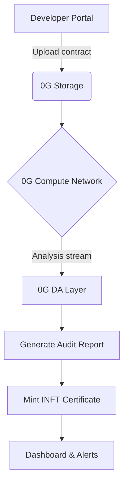

# ChainSage: AI-Powered Smart Contract Auditor
[](https://0g.ai)

## Overview
ChainSage leverages 0G's decentralized AI stack to provide:
- ⚡ Real-time vulnerability detection
- 📜 Human-readable audit reports
- 🔒 INFT-based audit certificates
- ⛽ Gas optimization recommendations

## Architecture


## Setup Guide
## Prerequisites
- Node.js v18+
- MetaMask (0G Testnet configured)
- 0G API Key (from [Portal](https://console.0g.ai/))

### Installation
```bash
# Clone repo
git clone https://github.com/your-repo/chain-sage

# Install dependencies
cd chain-sage
npm install

# Configure environment
cp .env.example .env
```

### Running Audits
```javascript
import { ChainSage } from 'chain-sage-sdk';

const auditor = new ChainSage({
  network: '0g_testnet',
  aiModel: 'vulnerability-detector-v3'
});

const report = await auditor.analyzeContract(
  '0xYourContractAddress', 
  { 
    auditIntensity: 'deep',
    optimization: true 
  }
);

console.log(report.toINFTMetadata());
```

## INFT Integration
Audit certificates use ERC-7857 standard with:
```json
{
  "ai_model": "chain-sage-v1.0",
  "risk_score": 0.24,
  "vulnerabilities": ["reentrancy", "gas_lock"],
  "dynamic_fields": {
    "last_scan": "2025-08-08T12:34:56Z",
    "active_threats": false
  }
}
```

## Demo Video
[Demo Video](https://img.youtube.com/vi/demo/0.jpg)

Resources
- [0G Chain Integration Guide](https://docs.0g.ai/chain)
- [INFT Standard (ERC-7857)](https://github.com/0glabs/INFT)
- [Sample Audit Reports](https://github.com/your-repo/chain-sage/tree/main/audits)
